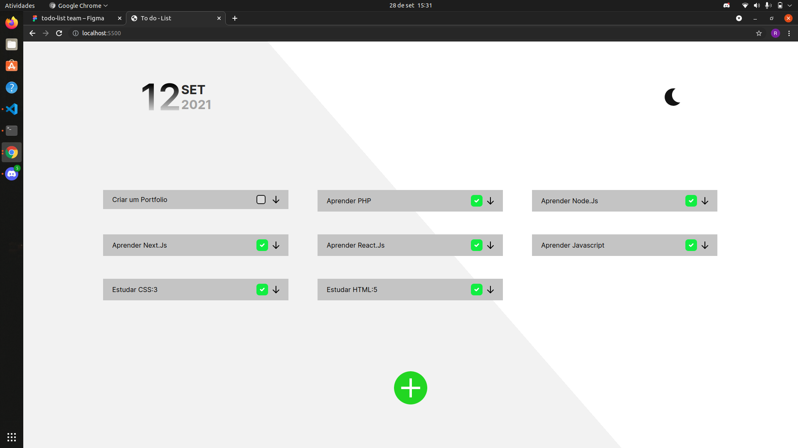

# To do - List
## Objetivo: 
#### Visualizar de forma geral tarefas e compromissos em listas, tendo a possibilidade de marcar ou desmarcar as tarefas concluidas.
 

### Informacoes:

#### Link para o figma [https://www.figma.com/file...](https://www.figma.com/file/CxRmmlxd6LQEdW0idU01Nu/todo-list-team?node-id=329%3A785)

 

> versao 0.0.2 alpha

 

#### Utilize uma descricao resumida seguido de um emblema para identificar seu commit.
|Codigo|Emblema|Valor|
| -------- | -------- | -------- |
|`:top:`|:top:|Atualizacao|
|`:space_invader:`|:space_invader:|Correcao de bug|

 

 
<h3 style="color: #B0C4DE;">Colaboradores:</h3>
<strong style="color:#777f;">Rian Carlos / riancontatoprofissional@gmail.com</strong>
 
 

    <strong style="">Andamento</strong>

    <h3>versao: 0.0.2 alpha</h3>
    

